# Django Observability

A full-stack Django observability setup with metrics, logs, alerting, and AI integration.


---

## Quick Start

```bash
# Clone
git clone https://github.com/MdAshiqurRahmanZayed/django-observability.git
cd django-observability

# Configure
cp django_app/.env.example django_app/.env

# Run
docker compose -f django_app/docker-compose.yml up -d --build
```

---

## Services

| Service | URL | Purpose |
|---------|-----|---------|
| Django | http://localhost | Application |
| Grafana | http://localhost:3000 | Dashboards |
| Prometheus | http://localhost:9090 | Metrics |
| Alertmanager | http://localhost:9093 | Alerts |
| Loki | http://localhost:3100 | Logs |
| pgAdmin | http://localhost:5050 | Database Admin |

---

## Architecture



---

## Configuration

### Slack Webhook (Optional)

Required for alert notifications. Leave empty to disable alerts.

**How to get:**
1. Go to https://api.slack.com/apps
2. Click **Create New App** → **From scratch**
3. Name it (e.g., "Django Alerts") and select workspace
4. Go to **Incoming Webhooks** → Toggle **On**
5. Click **Add New Webhook to Workspace**
6. Select channel (e.g., #alerts)
7. Copy the webhook URL

**Format:** `See https://api.slack.com/apps to get your webhook URL`

### Sentry DSN (Optional)

Required for error tracking. Leave empty to disable error tracking.

**How to get:**
1. Go to https://sentry.io (create account if needed)
2. Click **Create Project** → Select **Django**
3. Copy the DSN from the setup page
4. Or go to **Settings** → **Projects** → **Your Project** → **Client Keys (DSN)**

**Format:** `https://<key>@o<org>.ingest.sentry.io/<project>`

---

## Documentation

📚 **Full documentation:** [GitHub Pages](https://mdashiqurrahmanzayed.github.io/django-observability/)

- [Getting Started](https://mdashiqurrahmanzayed.github.io/django-observability/getting-started/)
- [Architecture](https://mdashiqurrahmanzayed.github.io/django-observability/architecture/)
- [Tutorial](https://mdashiqurrahmanzayed.github.io/django-observability/tutorial/setup/)
- [Modules](https://mdashiqurrahmanzayed.github.io/django-observability/modules/01-django-app/)
- [Contributing](https://mdashiqurrahmanzayed.github.io/django-observability/contributing/)

---

## Commands

```bash
# Start (with rebuild)
docker compose -f django_app/docker-compose.yml up -d --build

# Stop
docker compose -f django_app/docker-compose.yml down

# Logs
docker logs -f obs-django

# Restart
docker compose -f django_app/docker-compose.yml restart obs-django
```

---

## Contributing

See [CONTRIBUTING.md](CONTRIBUTING.md) for guidelines.

---

## License

MIT
