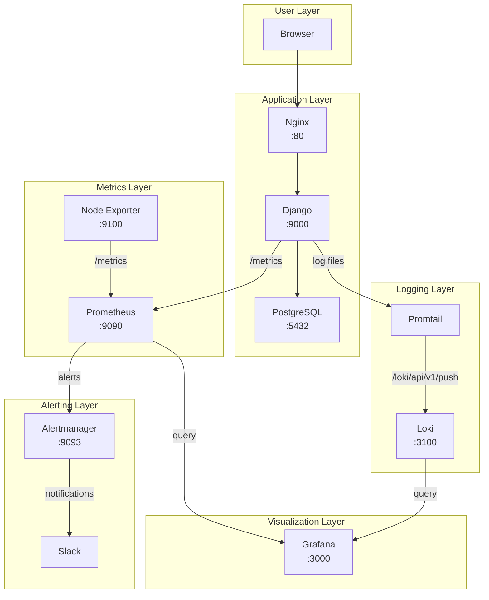
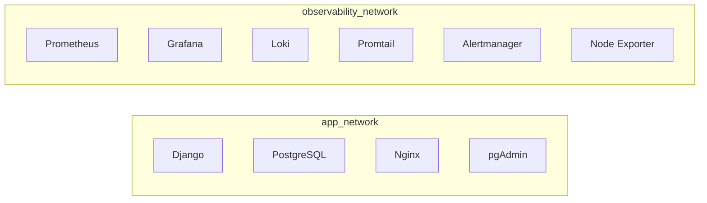

# Architecture Overview

<div align="center" markdown>

**Understanding how all the pieces fit together**

</div>

---

## 🏗️ System Architecture

Here's the complete architecture of the observability stack:



---

## 🔄 Data Flow

### How Metrics Flow (Pull Model)

The metrics flow is a **pull model** - Prometheus scrapes data from your application:

```
┌─────────────────────────────────────────────────────────────────┐
│                     METRICS FLOW                                │
├─────────────────────────────────────────────────────────────────┤
│                                                                  │
│  1. Django exposes /metrics endpoint                            │
│     (auto-instrumented with django_prometheus)                  │
│                                                                  │
│  2. Prometheus scrapes every 15 seconds                         │
│     GET http://obs-django:9000/metrics                          │
│                                                                  │
│  3. Prometheus stores metrics in TSDB                           │
│     (Time Series Database)                                      │
│                                                                  │
│  4. Grafana queries Prometheus for visualization                │
│     PromQL queries via API                                      │
│                                                                  │
│  5. Alertmanager evaluates rules                                │
│     Sends alerts to Slack when thresholds are breached          │
│                                                                  │
└─────────────────────────────────────────────────────────────────┘
```

### How Logs Flow (Push Model)

The logs flow is a **push model** - Promtail pushes logs to Loki:

```
┌─────────────────────────────────────────────────────────────────┐
│                      LOGS FLOW                                  │
├─────────────────────────────────────────────────────────────────┤
│                                                                  │
│  1. Django writes JSON logs to /app/logs/django.log             │
│     (via Python logging module)                                 │
│                                                                  │
│  2. Promtail tails the log file continuously                    │
│     (like `tail -f`)                                            │
│                                                                  │
│  3. Promtail parses JSON and extracts labels                    │
│     level, logger, message                                      │
│                                                                  │
│  4. Promtail pushes to Loki                                     │
│     POST http://obs-loki:3100/loki/api/v1/push                 │
│                                                                  │
│  5. Loki stores logs with indexed labels                        │
│     (not full-text, label-based)                                │
│                                                                  │
│  6. Grafana queries Loki for log visualization                  │
│     LogQL queries                                               │
│                                                                  │
└─────────────────────────────────────────────────────────────────┘
```

---

## 🌐 Container Map

| Container | Port | Networks | Purpose | How It Works |
|-----------|------|----------|---------|--------------|
| obs-django | 9000 | app, observability | Your application | Exposes /metrics endpoint |
| obs-postgres | 5439 | app | Database | Stores todo data |
| obs-prometheus | 9090 | observability | Metrics collector | Scrapes targets every 15s |
| obs-grafana | 3000 | observability | Visualization | Queries Prometheus & Loki |
| obs-loki | 3100 | observability | Log storage | Stores indexed logs |
| obs-promtail | - | observability | Log shipper | Tails files, pushes to Loki |
| obs-alertmanager | 9093 | observability | Alert router | Sends to Slack |
| obs-nginx | 80 | app | Reverse proxy | Routes requests to Django |
| obs-node-exporter | 9100 | observability | System metrics | CPU, memory, disk |
| obs-pgadmin | 5050 | app | DB admin | Web UI for PostgreSQL |

---

## 🔌 Network Architecture

The containers communicate via two Docker networks:



**Why two networks?**

- **app_network**: Application containers (Django, PostgreSQL, Nginx)
- **observability_network**: Monitoring containers + Django (for metrics collection)

Django is on both networks because it needs to:

- Talk to PostgreSQL (app_network)
- Expose metrics to Prometheus (observability_network)
- Write logs that Promtail can read (observability_network)

---

## 📊 Key Metrics Explained

### HTTP Metrics (from Django)

| Metric | What It Measures |
|--------|------------------|
| `django_http_requests_total` | Total number of requests |
| `django_http_requests_latency_seconds` | Request duration histogram |
| `django_http_responses_total_by_status` | Response count by status code |

### Database Metrics (from PostgreSQL)

| Metric | What It Measures |
|--------|------------------|
| `django_db_query_duration_seconds` | Database query time |
| `django_db_errors_total` | Database error count |
| `django_db_execute_total` | Total DB queries |

### System Metrics (from Node Exporter)

| Metric | What It Measures |
|--------|------------------|
| `node_cpu_seconds_total` | CPU usage by mode |
| `node_memory_MemAvailable_bytes` | Available memory |
| `node_filesystem_avail_bytes` | Available disk space |

---

## 🔔 Alert Flow

```
┌─────────────────────────────────────────────────────────────────┐
│                       ALERT FLOW                                │
├─────────────────────────────────────────────────────────────────┤
│                                                                  │
│  1. Prometheus evaluates alert rules every 15 seconds           │
│                                                                  │
│  2. Alert condition met (e.g., Django is down)                  │
│                                                                  │
│  3. Prometheus sends alert to Alertmanager                      │
│     POST http://obs-alertmanager:9093/api/v1/alerts            │
│                                                                  │
│  4. Alertmanager groups and routes alerts                       │
│     - db alerts → #alerts-db                                    │
│     - http alerts → #alerts-http                                │
│     - latency alerts → #alerts-latency                          │
│     - infra alerts → #alerts-infra                              │
│                                                                  │
│  5. Slack receives notification                                 │
│     With formatted message and severity                         │
│                                                                  │
└─────────────────────────────────────────────────────────────────┘
```

---

## 🔧 Configuration Files

| File | Purpose | Key Settings |
|------|---------|--------------|
| `prometheus/prometheus.yml` | Scrape configuration | Targets, intervals |
| `prometheus/rules/alerts.yml` | Alert rules | Thresholds, severity |
| `alertmanager/alertmanager.yml` | Alert routing | Slack channels, grouping |
| `promtail/promtail-config.yml` | Log collection | Files to tail, labels |
| `loki/loki-config.yml` | Log storage | Retention, schema |
| `grafana/provisioning/datasources/datasources.yml` | Datasources | Prometheus & Loki URLs |
| `nginx/nginx.conf` | Reverse proxy | Upstream, locations |
| `django_app/config/settings.py` | Django config | Metrics, logging |

---

## 🎓 Understanding the Components

### What is Prometheus?

**Prometheus** is a metrics collection system that:

- **Pulls** metrics from targets (your Django app)
- Stores them in a time-series database
- Evaluates alert rules
- Sends alerts to Alertmanager

### What is Loki?

**Loki** is a log aggregation system that:

- **Receives** logs via HTTP push
- Indexes only metadata (labels), not full text
- Stores compressed log data
- Provides LogQL query language

### What is Promtail?

**Promtail** is a log shipping agent that:

- **Tails** log files (reads new lines)
- Parses JSON log format
- Extracts labels
- Pushes to Loki

### What is Grafana?

**Grafana** is a visualization platform that:

- Connects to Prometheus (metrics)
- Connects to Loki (logs)
- Creates dashboards and graphs
- Supports alerting

---

## 🔍 How to Inspect

### Check Container Health

```bash
# View all containers
docker ps

# Check specific container
docker inspect obs-django --format '{{.State.Health.Status}}'

# View container logs
docker logs obs-django --tail 20
```

### Check Network Connectivity

```bash
# List networks
docker network ls

# Inspect network
docker network inspect django_app_observability_network

# Test connectivity from container
docker exec obs-django wget -qO- http://obs-prometheus:9090/-/healthy
```

### Check Metrics

```bash
# Query Prometheus
curl http://localhost:9090/api/v1/query?query=up

# Check Django metrics
curl http://localhost:9000/metrics | grep django_http
```

### Check Logs

```bash
# Query Loki
curl 'http://localhost:3100/loki/api/v1/query?query=%7Bapp%3D%22django%22%7D'

# View log file
docker exec obs-django cat /app/logs/django.log | tail -5
```

---

## 📚 Learn More

Now that you understand the architecture, explore the modules:

### Start Here

- [Django App](modules/01-django-app.md) - The application being monitored
- [Prometheus](modules/02-prometheus.md) - Metrics collection

### Then Explore

- [Grafana](modules/03-grafana.md) - Visualization
- [Loki](modules/04-loki.md) - Log aggregation
- [Alertmanager](modules/06-alertmanager.md) - Alerting

---

<div align="center" markdown>

**Ready to dive deeper?** 👇

[Django App Module →](modules/01-django-app.md){ .md-button .md-button--primary }

</div>
