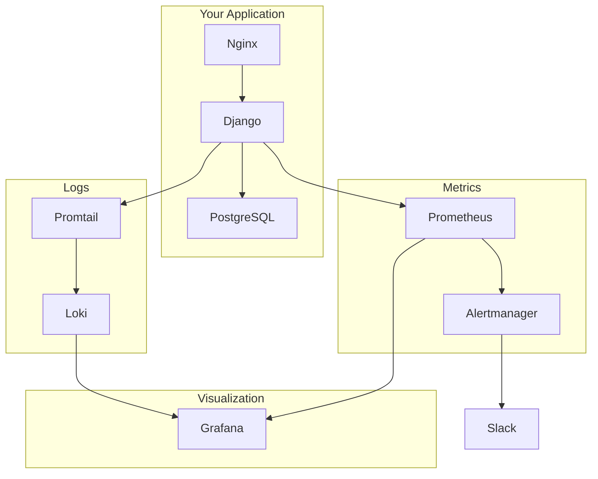

# Django Observability Stack

<div align="center" markdown>


**A complete tutorial & guide for building observability in Django applications**

[Start Tutorial](getting-started.md){ .md-button .md-button--primary }
[View on GitHub](https://github.com/MdAshiqurRahmanZayed/django-observability){ .md-button }

</div>

---

## 👋 Welcome

This project is a **hands-on tutorial** for adding observability to your Django applications. Whether you're a beginner or experienced developer, you'll learn how to:

- 📊 **Monitor metrics** - Track request rates, latency, errors
- 📝 **Aggregate logs** - Centralize logs from all services
- 🔔 **Set up alerts** - Get notified when things go wrong
- 📈 **Visualize data** - Create dashboards to understand your app
- 🤖 **Integrate AI** - Use MCP server for AI-powered insights

---

## 🎯 What You'll Learn

### By the end of this tutorial, you'll be able to

| Skill | What You'll Master |
|-------|-------------------|
| **Metrics** | Auto-instrument Django with Prometheus |
| **Logs** | Ship JSON logs to Loki with Promtail |
| **Visualization** | Create Grafana dashboards |
| **Alerting** | Set up Slack notifications for critical issues |
| **Docker** | Containerize the entire stack |
| **AI Integration** | Use MCP server for AI-powered analysis |

---

## 🚀 Quick Start

### Prerequisites

- Docker Desktop installed
- Basic Django knowledge
- Terminal access

### Get Started in 3 Steps

```bash
# 1. Clone the repository
git clone https://github.com/MdAshiqurRahmanZayed/django-observability.git
cd django-observability

# 2. Configure environment
cp django_app/.env.example django_app/.env

# 3. Start everything
docker compose -f django_app/docker-compose.yml up -d
```

### Access Your Stack

| Service | URL | What It Does |
|---------|-----|--------------|
| 🌐 Django App | <http://localhost> | Your application |
| 📊 Grafana | <http://localhost:3000> | Dashboards & visualization |
| 📈 Prometheus | <http://localhost:9090> | Metrics & queries |
| 🔔 Alertmanager | <http://localhost:9093> | Alert routing |
| 📝 Loki | <http://localhost:3100> | Log aggregation |
| 🗄️ pgAdmin | <http://localhost:5050> | Database admin |

---

## 📚 Tutorial Path

Follow these steps in order:

### Step 1: Setup

→ [Getting Started](getting-started.md) - Install and configure the stack

### Step 2: Understand

→ [Architecture Overview](architecture.md) - Learn how everything connects

### Step 3: Explore Modules

→ [Django App](modules/01-django-app.md) - Understand the application

→ [Prometheus](modules/02-prometheus.md) - Learn metrics collection

→ [Grafana](modules/03-grafana.md) - Create dashboards

→ [Loki](modules/04-loki.md) - Aggregate logs

→ [Alertmanager](modules/06-alertmanager.md) - Set up alerts

### Step 4: Advanced

→ [MCP Server](modules/08-mcp-server.md) - AI integration

---

## 🏗️ Architecture at a Glance



---

## 📦 What's Included

| Component | Technology | Purpose |
|-----------|------------|---------|
| **Django App** | Python 5.x | Todo application |
| **Prometheus** | Latest | Metrics collection |
| **Grafana** | Latest | Visualization |
| **Loki** | 2.9.0 | Log aggregation |
| **Promtail** | 2.9.0 | Log shipping |
| **Alertmanager** | Latest | Alert routing |
| **Nginx** | Alpine | Reverse proxy |
| **PostgreSQL** | 16 | Database |
| **MCP Server** | Python | AI integration |

---

## 🎓 Who Is This For?

- **Django developers** who want to monitor their applications
- **DevOps engineers** setting up observability stacks
- **Students** learning modern monitoring practices
- **Anyone** interested in Prometheus, Grafana, and Loki

---

## 🤝 Contributing

We welcome contributions from the community! Whether you're fixing a bug, adding a feature, or improving documentation, your help makes this project better for everyone.

### Ways to Contribute

| Contribution Type | Description |
|-------------------|-------------|
| 🐛 **Bug Reports** | Found something broken? Let us know! |
| 💡 **Feature Requests** | Have an idea? We'd love to hear it! |
| 📝 **Documentation** | Improve guides, fix typos, add examples |
| 🔧 **Code** | Fix bugs, add features, improve tests |
| 📷 **Screenshots** | Add screenshots for different setups |

### How to Contribute

#### 1. Fork & Clone

```bash
# Fork the repository on GitHub
# Then clone your fork
git clone https://github.com/YOUR-USERNAME/django-observability.git
cd django-observability
```

#### 2. Create a Branch

```bash
git checkout -b feature/your-feature-name
# or
git checkout -b fix/your-bug-fix
```

#### 3. Make Changes

- Follow existing code style
- Add tests if applicable
- Update documentation as needed

#### 4. Test Your Changes

```bash
# Start the stack
docker compose -f django_app/docker-compose.yml up -d

# Verify everything works
curl http://localhost:9000/metrics
curl http://localhost:9090/-/healthy
curl http://localhost:3000/api/health
```

#### 5. Submit a Pull Request

```bash
git add .
git commit -m "feat: add your feature description"
git push origin feature/your-feature-name
```

Then create a Pull Request on GitHub.

### Contribution Guidelines

- ✅ Keep PRs focused on a single change
- ✅ Write clear commit messages
- ✅ Update documentation for new features
- ✅ Test your changes before submitting
- ✅ Be respectful and constructive

### Getting Help

- 💬 [GitHub Discussions](https://github.com/MdAshiqurRahmanZayed/django-observability/discussions)
- 🐛 [Issue Tracker](https://github.com/MdAshiqurRahmanZayed/django-observability/issues)
- 📧 [Email](mailto:your-email@example.com)

### Contributors

Thank you to everyone who has contributed to this project! 🎉

[View Contributors](https://github.com/MdAshiqurRahmanZayed/django-observability/graphs/contributors){ .md-button }

---

## 📄 License

This project is licensed under the **MIT License** - see the [LICENSE](https://github.com/MdAshiqurRahmanZayed/django-observability/blob/main/LICENSE) file for details.

This project is primarily for **educational purposes** - demonstrating observability best practices with Django.

---

<div align="center" markdown>

**Ready to start?** 👇

[Get Started Now](getting-started.md){ .md-button .md-button--primary }

</div>
