# Screenshots Gallery

This page showcases all the screenshots from the Django Observability Stack. Use the tabs below to browse by category.

---

## 📊 Grafana Dashboards

=== "Overview"

    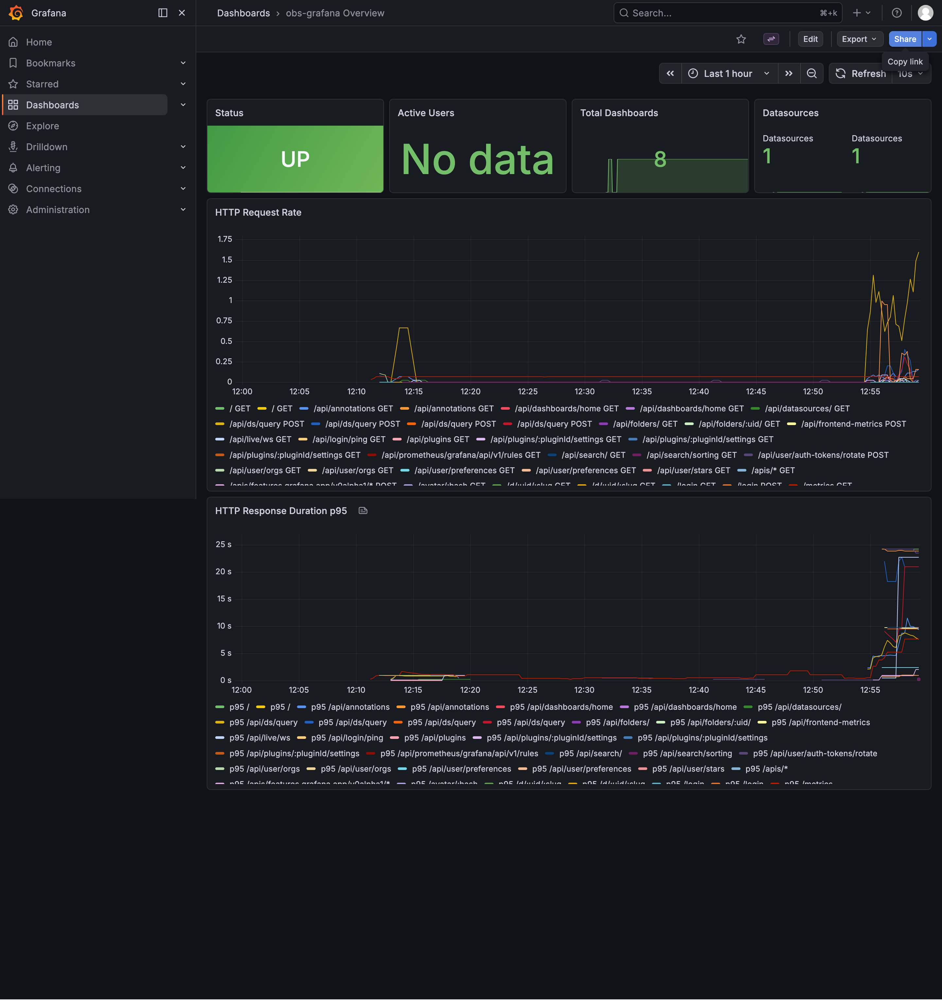

    **Main Dashboard** - Overview of all services and metrics

=== "Django Metrics"

    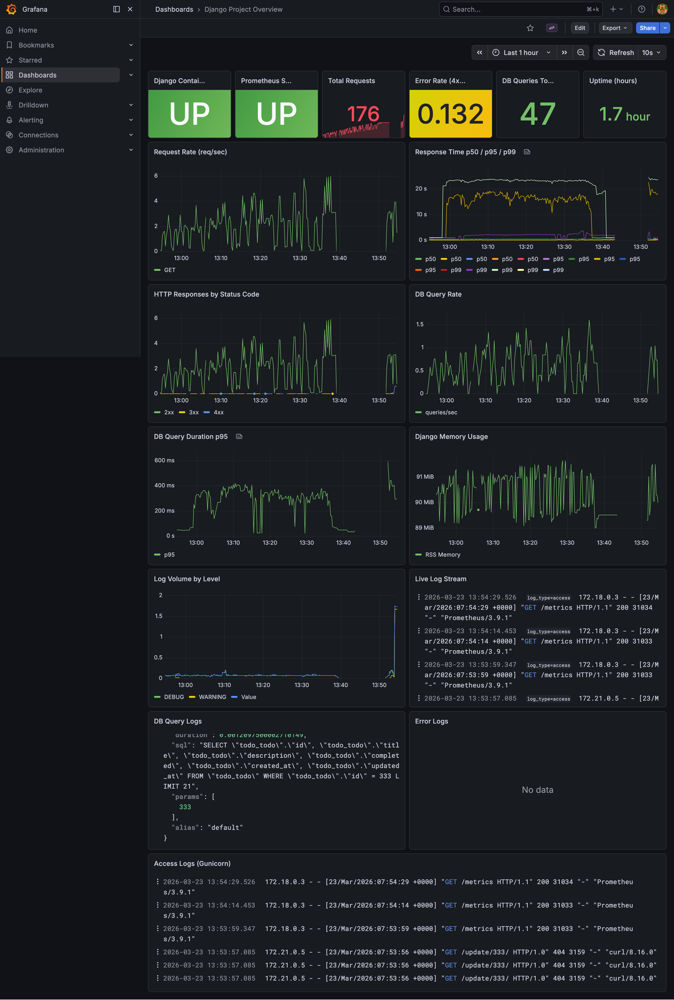

    **Django Dashboard** - HTTP requests, latency, and errors

=== "Grafana Dashboard"

    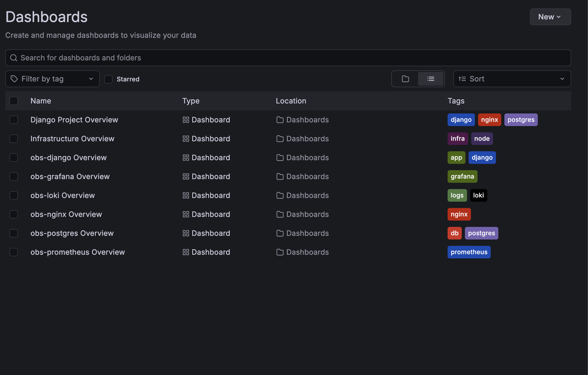

    **Detailed View** - Custom Grafana dashboard configuration

=== "Infrastructure"

    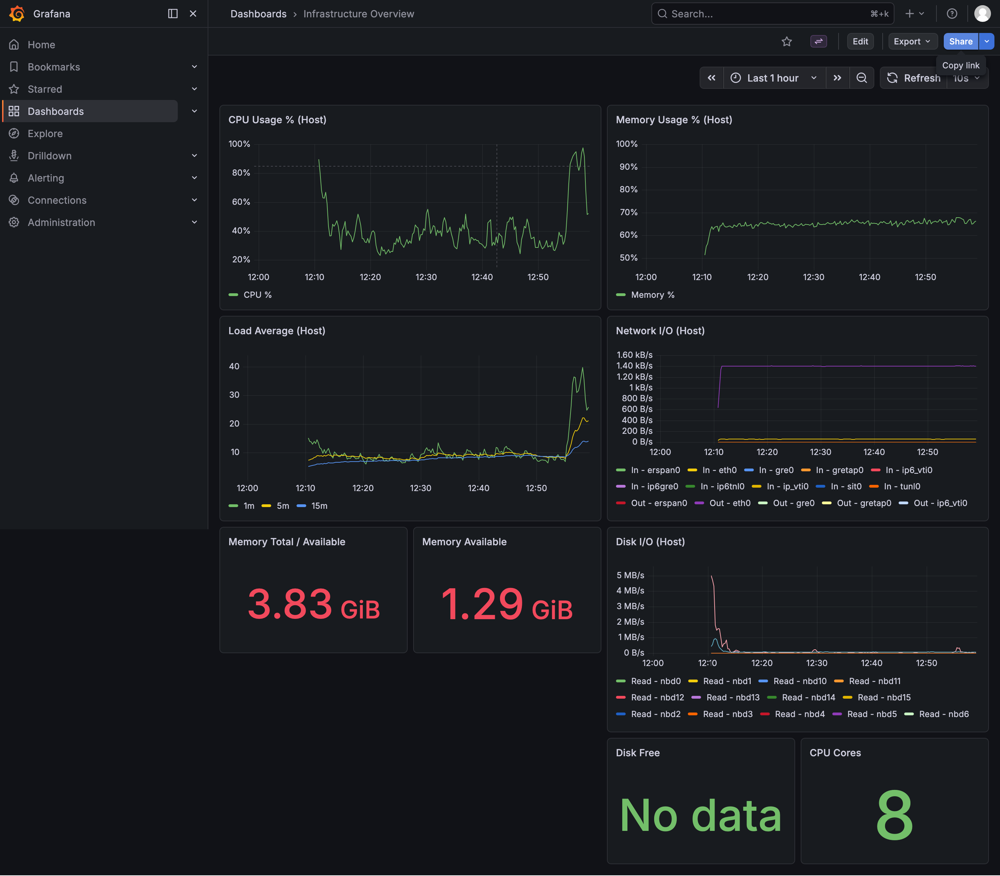

    **Infrastructure Dashboard** - CPU, memory, and disk usage

=== "Loki Logs"

    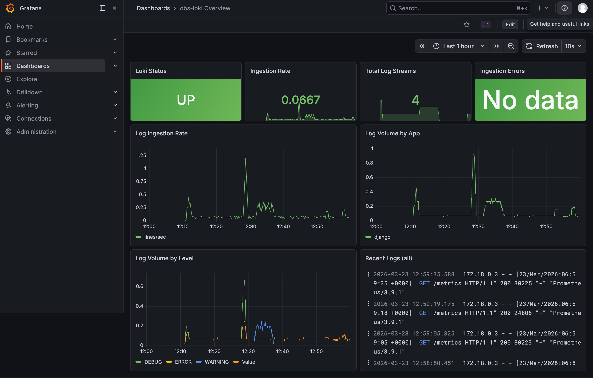

    **Loki Dashboard** - Log aggregation and search

=== "Nginx"

    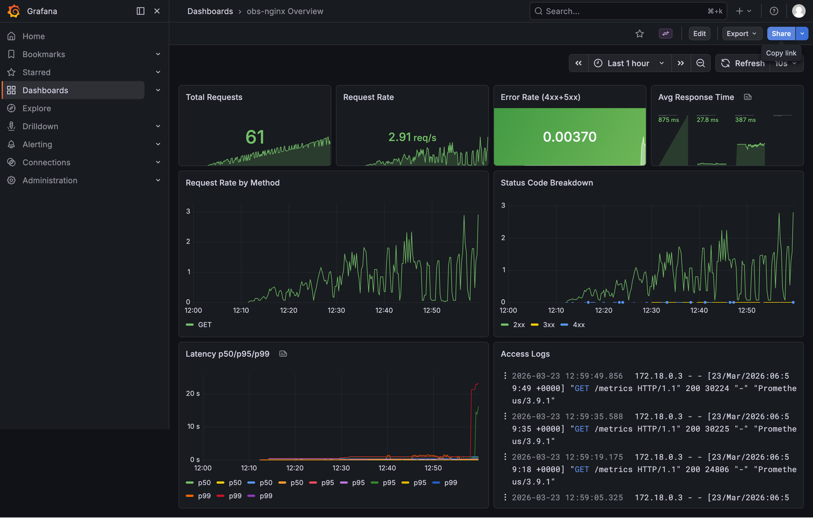

    **Nginx Dashboard** - Reverse proxy metrics

---

## 📝 Application

=== "Todo App"

    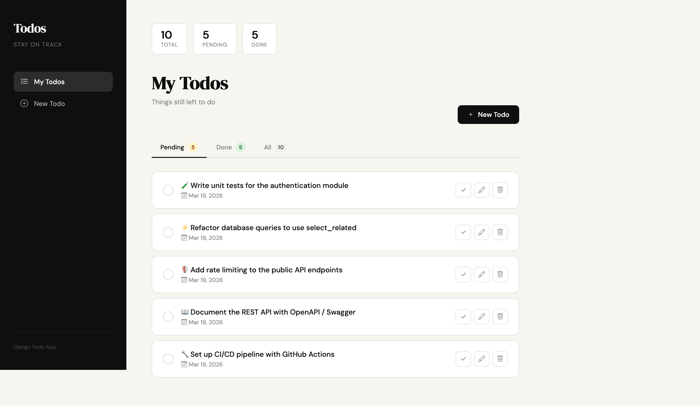

    **Todo Application** - Django app being monitored

---

## 🤖 MCP Server

=== "Server Status"

    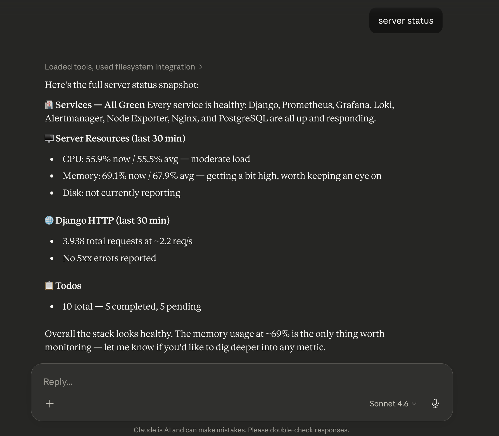

    **MCP Server** - Health check and service status

=== "Latest Todos"

    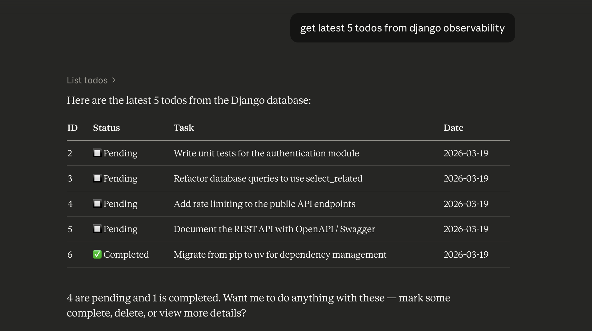

    **MCP Tool** - Fetching latest todos via MCP server

---

## 📈 Prometheus

=== "Overview"

    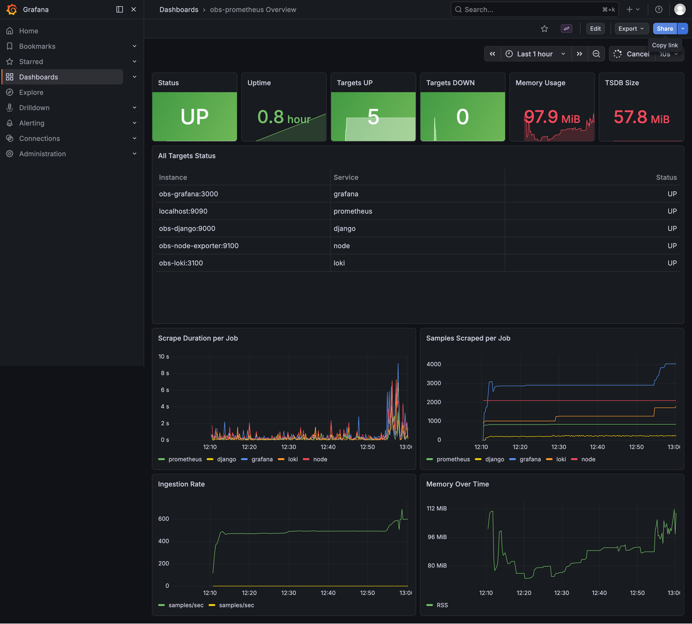

    **Prometheus UI** - Main metrics dashboard

=== "Alerts"

    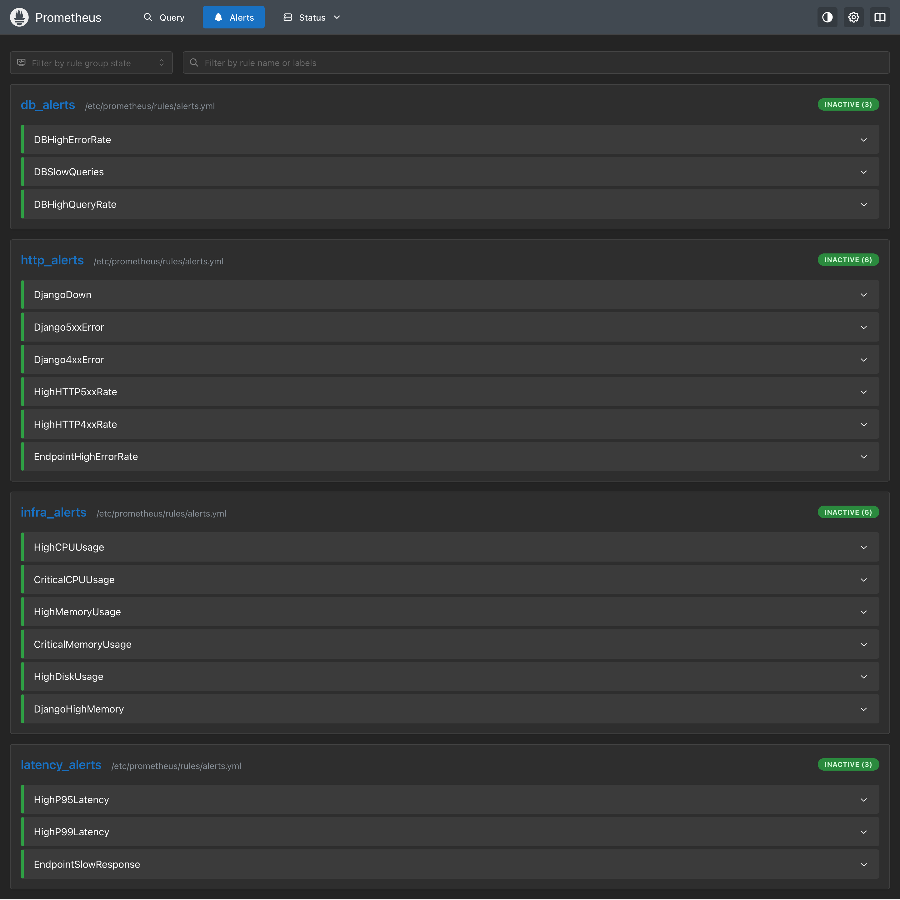

    **Alert Rules** - Configured alert rules in Prometheus

=== "Alertmanager"

    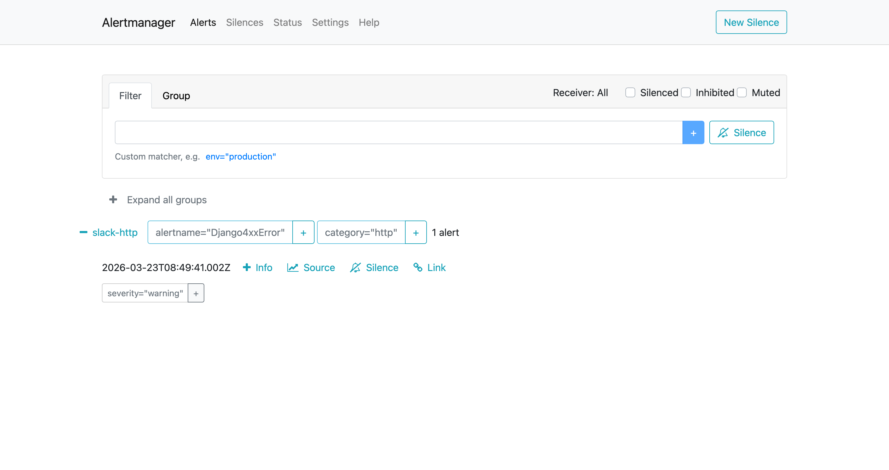

    **Alertmanager UI** - Alert routing and notifications

=== "Health Status"

    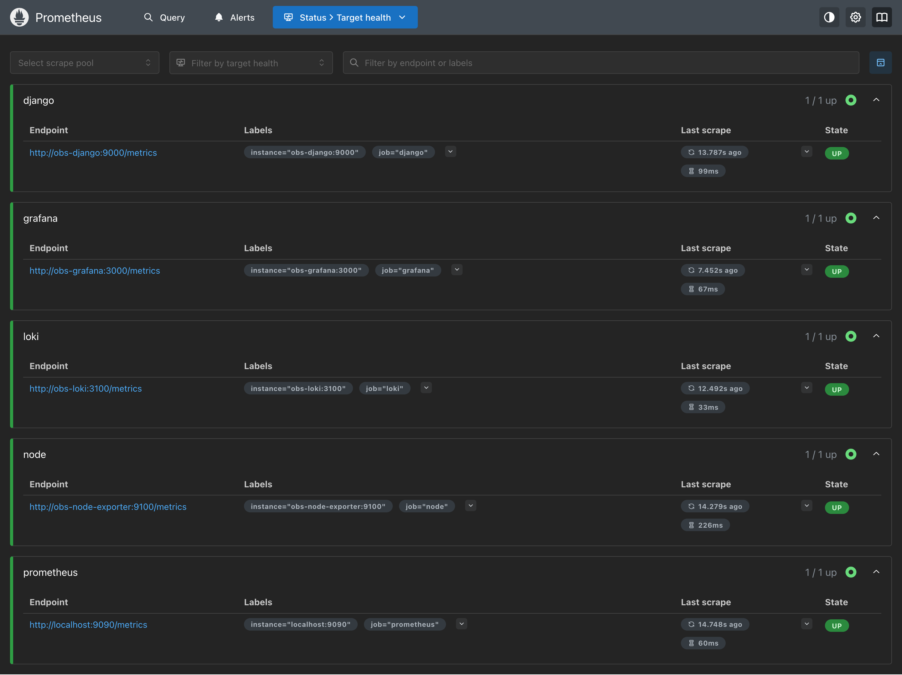

    **Health Status** - Target health monitoring

---

## 🎨 What You'll See

When you run the stack, you'll have access to:

| Feature | What It Shows |
|---------|---------------|
| **Grafana Dashboards** | Real-time metrics visualization |
| **Prometheus UI** | Raw metrics and PromQL queries |
| **Alertmanager** | Alert status and routing |
| **Loki/LogQL** | Log search and analysis |
| **MCP Server** | AI-powered insights |

---

## 📱 Taking Your Own Screenshots

Want to capture your own screenshots? Here's how:

### Grafana

1. Open <http://localhost:3000>
2. Login with admin/admin
3. Navigate to Dashboards
4. Press `Cmd+Shift+4` (Mac) or `Win+Shift+S` (Windows)

### Prometheus

1. Open <http://localhost:9090>
2. Go to Status → Targets
3. Take screenshot of target health

### Application

1. Open <http://localhost>
2. Create some todos
3. Take screenshot of the app

---

**Ready to explore?** 👇

[Start Tutorial](getting-started.md){ .md-button .md-button--primary }

